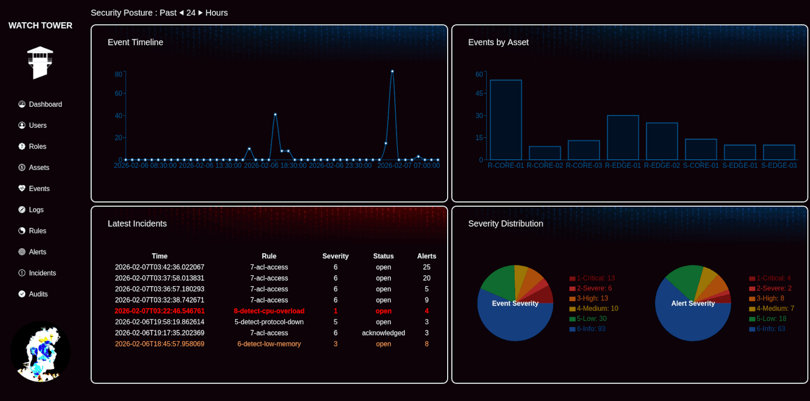
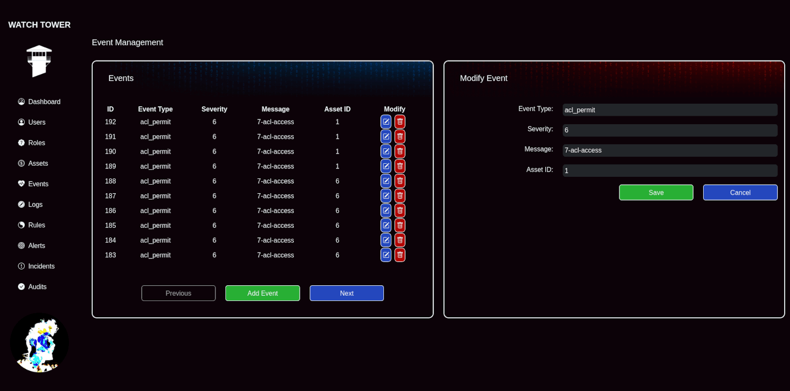
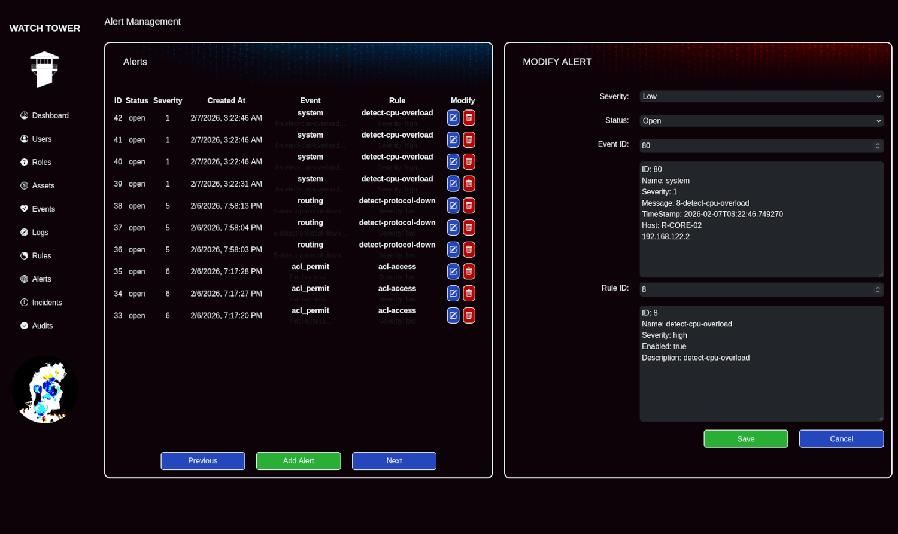
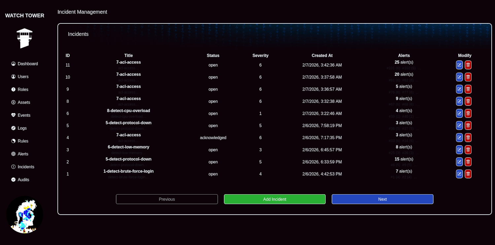
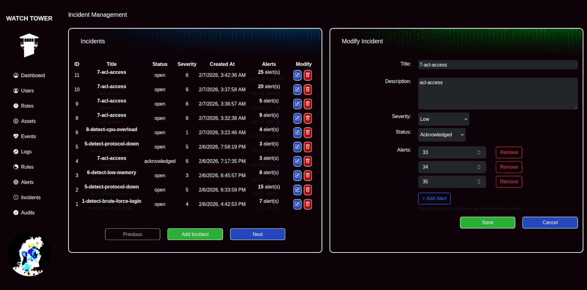
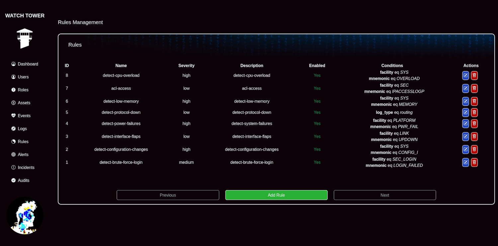
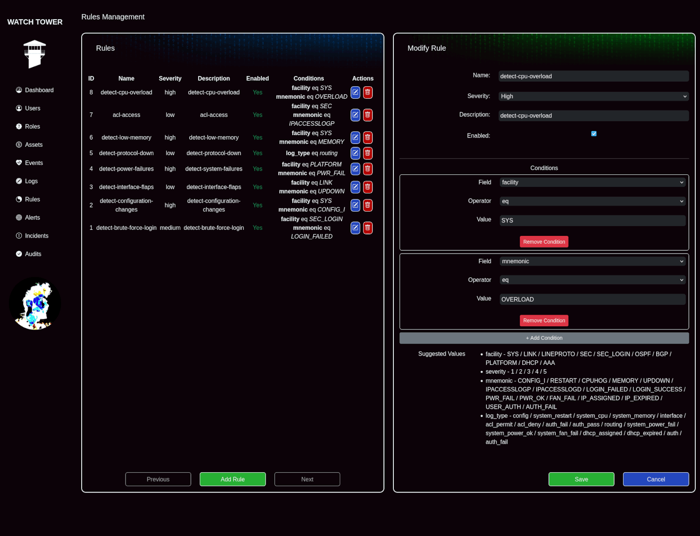
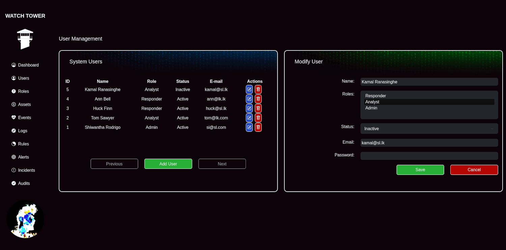
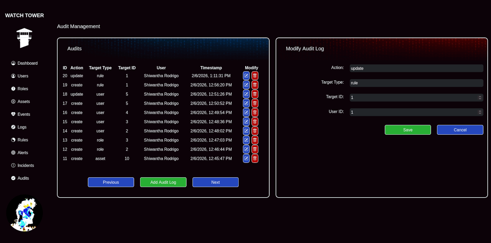

# WATCH TOWER
The Lightweight SIEM Platform



A lightweight, modular **SIEM (Security Information and Event Management)** tool built with **rsyslog**, **FastAPI**, **Python**, **React**, **SQLite**, and **SQLAlchemy**.

This project ingests and analyzes syslog data (currently **Cisco IOS** formats), correlates events with assets, applies customizable detection rules and visualizes security insights through an interactive **React-based dashboard**.

## 📚 Table of Contents
<details>
<summary><strong>Click to expand</strong></summary>

- [✨ Features](#-features)
- [⚙️ Tech Stack](#-tech-stack)
- [⚡ Quick Start](#-quick-start)
- [🏞️ User Interface Overview](#-user-interface-overview)
- [🚧 Current Limitations](#-current-limitations)
- [🚀 Future Improvements](#-future-improvements)

</details>

## ✨ Features
<details>
<summary><strong>Click to expand</strong></summary>

### 📑 Log Ingestion & Parsing

* Ingests logs via **Device** --> **rsyslog** --> **API**
* Currently supports **Cisco IOS syslog formats**
* Designed to extend to additional log sources and vendors

### 🎯 Event, Alert & Incident Correlation

The system follows a structured escalation model :

1. **Events**
   * Parsed directly by matching rules with incoming logs
   * Severity derived from log data or user-defined rules
2. **Alerts**
   * Triggered when **3 similar events** occur
   * Must be:
     * Within a **limited time window**
     * On the **same asset**
3. **Incidents**
   * Created when **multiple alerts** are raised for the same asset
   * Represents a higher-level security issue requiring investigation

This flow minimizes noise while highlighting actionable security issues.

### 🚨 Custom Rule Engine

* Define **custom detection rules** to catch any event
* Highly flexible rule logic and severity mapping
* Allows fine-grained tuning to match different environments and threat models

### 🔍 Interactive Dashboard

A modern **React-based frontend** provides clear visibility into security data though *Timelines, Charts, Graphs and tables*.\
All events, alerts and incidents are **highlighted by severity** *(log-derived or user-defined)* for instant recognition at a glance.

### 🧩 Asset Management & Log Correlation

* Store and manage an asset inventory
* Automatically correlate incoming logs with the relevant asset
* Enabling asset-centric analysis of security activity

### ⛔ Role-Based Access Control (RBAC)

* Multiple user roles with permission-based access
* Supports secure and structured operational workflows

### 🚩 Auditing & Accountability

* Comprehensive audit logging of **every user action**
* Enables forensic review, accountability, and compliance support

### ♻️ Incident Lifecycle Management

* Users can:
  * Review events, alerts and incidents
  * Acknowledge open items
  * Close resolved issues
* Supports collaborative incident response workflows

</details>

## ⚙️ Tech Stack
<details>
<summary><strong>Click to expand</strong></summary>

### Backend

* **Log Collection:** rsyslog
* **API Framework:** FastAPI
* **Language:** Python
* **Database:** SQLite
* **ORM:** SQLAlchemy

### Frontend

* **Framework:** React

</details>

## ⚡ Quick Start
<details>
<summary><strong>Click to expand</strong></summary>

### 🧩 Prerequisites

Make sure you have the following installed:

* Python **3.10+**
* Node.js **LTS** (NVM recommended)
* rsyslog (or syslog-ng)
* Git

> Developed and tested on **Arch Linux**. While other operating systems and distributions are untested, the application is expected to function correctly on most Linux distributions.

### 🧠 Backend Setup (FastAPI)
---

Clone the Repository

```
$ git clone https://github.com/Shiwantha-I-Rodrigo/watch_tower.git
$ cd watch_tower
```

Create and Enter Python Virtual Environment

```
$ python -m venv env
$ source env/bin/activate
```

Configure pip

```
$ python -m ensurepip --upgrade
$ python -m pip install --upgrade pip
```

Install Backend Dependencies

```
$ pip install "fastapi[standard]"
$ pip install sqlalchemy pydantic
```

Initialize Database

```
$ python init_db.py
```

Run FastAPI Server

```
$ fastapi dev main.py
```

Backend APIs will be available at : `http://127.0.0.1:8000`\
API documentation availabe at : `http://127.0.0.1:8000/docs`

### 📥 Log Ingestion (rsyslog)
---

**Cisco device (TCP/UDP) --> rsyslog --> FastAPI (HTTP) endpoint**

Install rsyslog

```
$ yay -S rsyslog
```

(Use your distro’s package manager)

Enable rsyslog

```
$ systemctl enable rsyslog.service
```

> Reboot the system, **Do Not** start the service manually.

Configure Syslog Listeners --> Create `/etc/rsyslog.d/10-cisco.conf`

```
module(load="imudp")
input(type="imudp" port="514")
module(load="imtcp")
input(type="imtcp" port="514")
```

Configure Log Routing to FastAPI --> Create `/etc/rsyslog.d/30-cisco.conf`

> Why **30**?
> rsyslog loads config files in lexical order:
>
> * `10-*` → listeners
> * `30-*` → routing rules

```
*.* action(
  type="omhttp"
  server="127.0.0.1"
  serverport="8000"
  restpath="/rawlogs/"
  httpmethod="post"
  template="RSYSLOG_TraditionalForwardFormat"
)
```

Restart rsyslog

```
$ systemctl restart rsyslog
```

---

### 🖥️ Frontend Setup (React)

Install NVM & Node.js

```
$ curl -o- https://raw.githubusercontent.com/nvm-sh/nvm/v0.39.2/install.sh | bash
$ source ~/.bashrc
$ nvm install --lts
$ nvm ls
```

Install Frontend Dependencies

```
$ cd dashboard/my-app
$ npm install
```

Install Vite

```
$ npm install -D vite
```

Run Vite OR Dev Server

```
$ npx vite OR $ npm run dev
```

Frontend will be available at : `http://127.0.0.1:5173`

</details>

## 🏞️ User Interface Overview
<details>
<summary><strong>Click to expand</strong></summary>

### Event Mangement


### Alerts and Incidents






### Asset Mangement (ANALYST ONLY)


### Customize Rules (ANALYST ONLY)




### User Mangement (ADMIN ONLY)


### Auditing (ADMIN ONLY)


</details>

## 🚧 Current Limitations
<details>
<summary><strong>Click to expand</strong></summary>

* Supports **Cisco IOS logs only** (initial implementation)
* SQLite backend (suited for small scale deployments)

</details>

## 🚀 Future Improvements
<details>
<summary><strong>Click to expand</strong></summary>

Planned enhancements:

* Move data extraction from backend(RegEx) to rsyslog process to improve performance
* Add buffering and queueing in rsyslog
* Add Support for additional log formats and vendors
  * Linux syslog
  * Windows Event Logs
  * Firewalls and IDS/IPS
* Integrate advanced correlation logic for behavioral detection
* Scalable storage backends (PostgreSQL, Elasticsearch or OpenSearch)
* Notifications via Email.
* ML-assisted anomaly detection (long-term goal)

</details>

<details>
<summary><strong>Temporary Notes</strong></summary>

Adding extraction / Buffering / Queue : `/etc/rsyslog.d/30-cisco.conf`
```
##############################
# Cisco IOS SIEM Processing  #
##############################

##########
# Template
##########

template(name="cisco_json" type="list") {
    constant(value="{")
        constant(value="\"timestamp\":\"")
            property(name="timereported" dateFormat="rfc3339")
        constant(value="\",\"hostname\":\"")
            property(name="hostname")
        constant(value="\",\"source_ip\":\"")
            property(name="fromhost-ip")
        constant(value="\",\"severity\":\"")
            property(name="syslogseverity-text")
        constant(value="\",\"facility\":\"")
            property(name="syslogfacility-text")
        constant(value="\",\"program\":\"")
            property(name="programname")
        constant(value="\",\"message\":\"")
            property(name="msg" format="json")
    constant(value="\"}")
}

########################
# Cisco Log Processing
########################

# Match remote logs only
# Cisco devices typically use local7, but we allow all remote sources
if ($fromhost-ip != "127.0.0.1") then {

    #################
    # Local log file
    #################
    action(
        type="omfile"
        file="/var/log/cisco.log"
        createDirs="on"
    )

    #########################
    # Forward to SIEM (HTTP)
    #########################
    action(
        type="omhttp"
        server="siem.example.com"
        serverport="443"
        usehttps="on"
        restpath="/ingest/syslog"
        template="cisco_json"
        httpheaders=["Content-Type: application/json"]

        # Queue for Reliability / performance
        queue.type="LinkedList"
        queue.size="100000"
        queue.dequeueBatchSize="100"
        action.resumeRetryCount="-1"
        action.reportSuspension="on"
        action.reportSuspensionContinuation="on"
    )

    # Stop further processing to avoid duplicates
    stop
}
```

**Cisco IOS Log Types -->**
`<PRI>MMM DD HH:MM:SS HOSTNAME %FACILITY-SEVERITY-MNEMONIC: message`

| Facility  | Mnemonics                         | Description                                  |
| --------- | --------------------------------- | -------------------------------------------- |
| SYS       | CONFIG_I, RESTART, CPUHOG, MEMORY | Config change, restart, high CPU, low memory |
| LINK      | UPDOWN                            | Interface link status change                 |
| LINEPROTO | UPDOWN                            | Protocol up/down events                      |
| SEC       | IPACCESSLOGP, IPACCESSLOGD        | ACL permit/deny logs                         |
| SEC_LOGIN | LOGIN_FAILED, LOGIN_SUCCESS       | Authentication events                        |
| OSPF      | ADJCHG                            | Neighbor adjacency change                    |
| BGP       | ADJCHANGE                         | BGP neighbor up/down                         |
| PLATFORM  | PWR_FAIL, PWR_OK, FAN_FAIL        | Hardware events                              |
| DHCP      | IP_ASSIGNED, IP_EXPIRED           | DHCP address events                          |
| AAA       | USER_AUTH, AUTH_FAIL              | Authentication/authorization events          |

| Severity | Meaning       |
| -------- | ------------- |
| 0/1      | Emergency     |
| 2        | Critical      |
| 3        | Errors        |
| 4        | Warnings      |
| 5        | Notifications |
| 6        | Informational |
| 7        | Debug         |

Test Logs -->
Feb 06 2026 09:01:05 %SYS-5-CONFIG_I: Configured from console by vty0 (10.1.1.50)
Feb 06 2026 09:02:11 %SEC-6-IPACCESSLOGP: list 101 denied tcp 192.168.122.100(44512) -> 192.168.10.5(22), 1 packet
Feb 06 2026 09:03:18 %LINK-3-UPDOWN: Interface GigabitEthernet0/0, changed state to down
Feb 06 2026 09:03:19 %LINEPROTO-5-UPDOWN: Line protocol on Interface GigabitEthernet0/0, changed state to down
Feb 06 2026 09:04:42 %LINK-3-UPDOWN: Interface GigabitEthernet0/0, changed state to up
Feb 06 2026 09:04:43 %LINEPROTO-5-UPDOWN: Line protocol on Interface GigabitEthernet0/0, changed state to up
Feb 06 2026 09:05:30 %SYS-5-RESTART: System restarted --
Feb 06 2026 09:06:22 %SEC_LOGIN-4-LOGIN_FAILED: Login failed [user: admin] [Source: 198.51.100.20] [localport: 22]
Feb 06 2026 09:07:01 %SEC_LOGIN-5-LOGIN_SUCCESS: Login Success [user: admin] [Source: 10.1.1.10] [localport: 22]
Feb 06 2026 09:08:44 %OSPF-5-ADJCHG: Process 1, Nbr 10.0.0.2 on GigabitEthernet0/1 from FULL to DOWN, Neighbor Down
Feb 06 2026 09:09:12 %OSPF-5-ADJCHG: Process 1, Nbr 10.0.0.2 on GigabitEthernet0/1 from DOWN to FULL, Loading Done
Feb 06 2026 09:10:55 %BGP-5-ADJCHANGE: neighbor 192.0.2.1 Down BGP Notification sent
Feb 06 2026 09:11:32 %BGP-5-ADJCHANGE: neighbor 192.0.2.1 Up
Feb 06 2026 09:12:19 %SEC-6-IPACCESSLOGP: list 101 permitted udp 10.10.10.5(5353) -> 224.0.0.251(5353), 1 packet
Feb 06 2026 09:13:47 %SYS-4-CPUHOG: Task ran for 3120 msec (3120/3120), process = IP Input
Feb 06 2026 09:14:58 %SYS-3-MEMORY: Low memory condition detected [Source: 10.1.1.10]
Feb 06 2026 09:15:33 %PLATFORM-2-PWR_FAIL: Power failure detected on power supply 1
Feb 06 2026 09:16:21 %PLATFORM-2-PWR_OK: Power restored on power supply 1
Feb 06 2026 09:17:45 %SEC_LOGIN-4-LOGIN_FAILED: Login failed [user: guest] [Source: 203.0.113.99] [localport: 23]
Feb 06 2026 09:18:59 %SYS-5-CONFIG_I: Configured from console by admin (console)

</details>